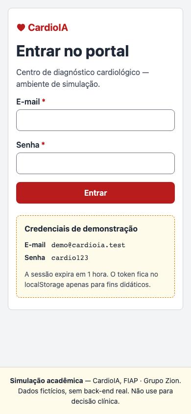
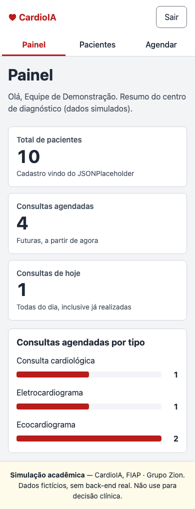
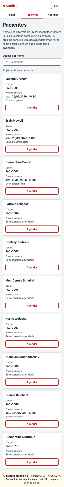
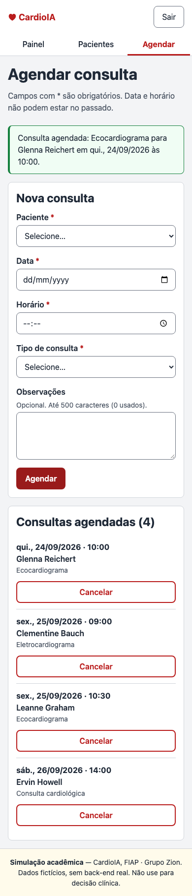
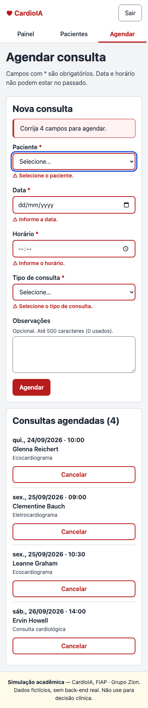
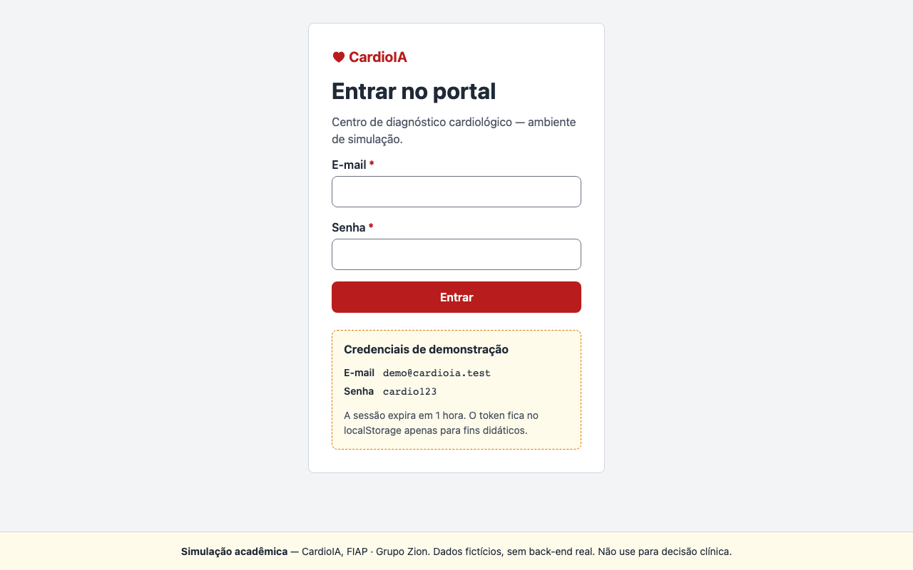
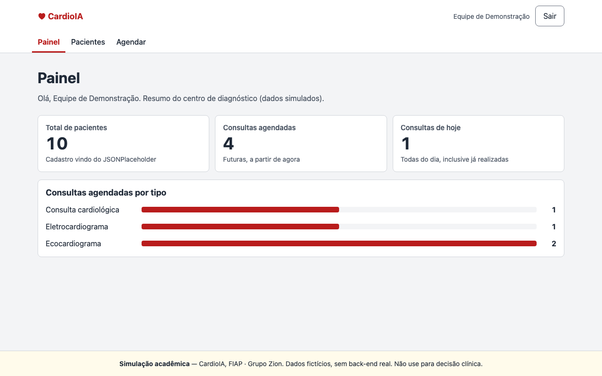
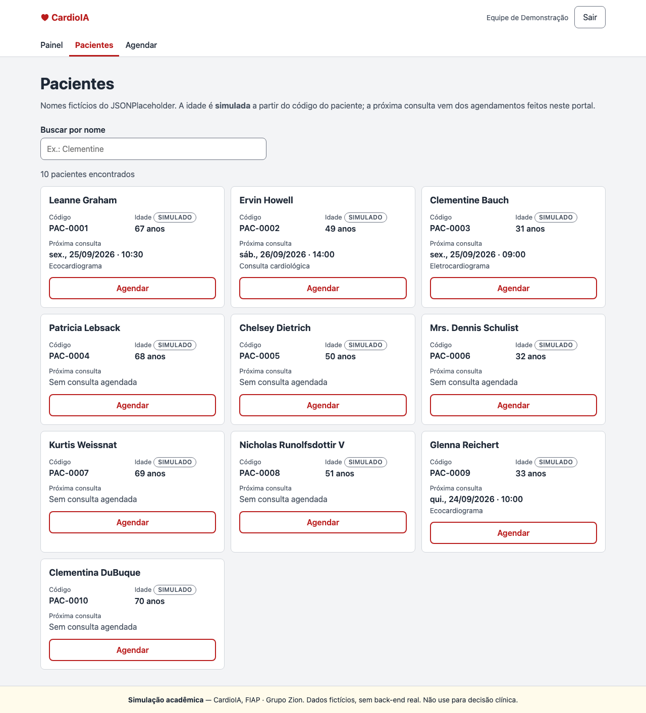
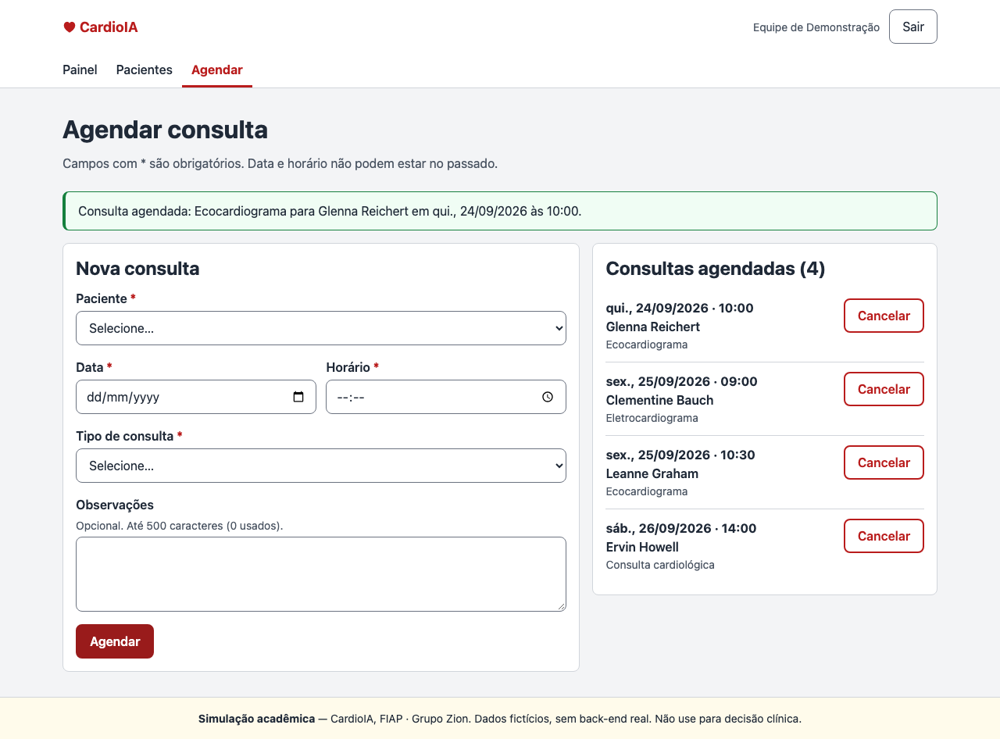
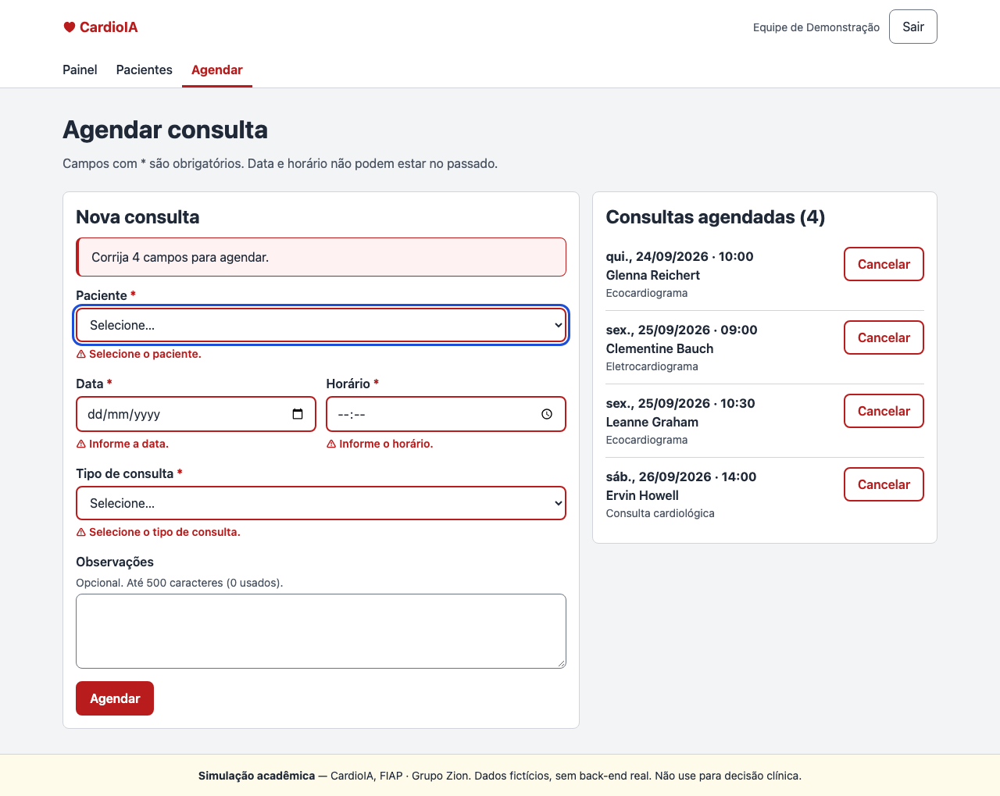

# CardioIA Portal — Ir Além 1 (Fase 2)

> ### 🌐 [Abrir o portal publicado](https://cesar-azeredo.github.io/grupo-zion-cardioia-portal/)
> `https://cesar-azeredo.github.io/grupo-zion-cardioia-portal/` · login: `demo@cardioia.test` / `cardio123`

> ⚠️ **Simulação acadêmica.** Não há back-end real nem dado de paciente real. Os nomes vêm do JSONPlaceholder e são fictícios. Nada aqui serve para decisão clínica.

Interface de um portal que simula a rotina de um centro de diagnóstico cardiológico: login, listagem de pacientes, agendamento de consultas e painel.

## Contexto

O **CardioIA** é um projeto acadêmico de Inteligência Artificial aplicada à cardiologia, desenvolvido em 7 fases no curso de IA da **FIAP**. Este repositório é o **Ir Além 1**, uma entrega extra da **Fase 2**: só a **interface** do portal, com dados simulados e sem back-end.

Repositório principal do projeto (fases, dados, modelos): **[github.com/Cesar-Azeredo/CardioAI](https://github.com/Cesar-Azeredo/CardioAI)**.

## Grupo Zion

| Integrante | RM |
|---|---|
| Cesar Martinho de Azeredo | RM568140 |
| Carlos Alberto Florindo Costato | RM567005 |
| Phellype Matheus Giacoia Flaibam Massarente | RM566826 |

**Tutor:** Andre Godoy · **Coordenadora:** Ana Cristina dos Santos

## Vídeo de demonstração

> ⚠️ TODO(humano): colar aqui o link do vídeo no YouTube (não listado, até 4 min)

## Credenciais de demonstração

| Campo | Valor |
|---|---|
| E-mail | `demo@cardioia.test` |
| Senha | `cardio123` |

A sessão dura 1 hora. As credenciais também aparecem na tela de login.

## Funcionalidades × requisitos do enunciado

| Requisito do enunciado | Funcionalidade que o cumpre |
|---|---|
| **Autenticação simulada via Context API, com JWT fake no localStorage** | `AuthContext` + `useAuth()`. Token `header.payload.assinatura` em base64url, com `exp`, gravado no `localStorage` e validado na carga: expirado, malformado ou adulterado = deslogado. Logout automático no vencimento e botão "Sair" no cabeçalho. |
| **Proteção de rotas com AuthContext** (dados só com usuário logado) | `ProtectedRoute` em volta de Painel, Pacientes e Agendar: sem login, manda para `/login` e, depois do login, **devolve à página que se tentou abrir**. A lista de pacientes só é buscada depois do login. |
| **Listagem de pacientes com API fake** | Consumo real de `https://jsonplaceholder.typicode.com/users` pelo `PatientsProvider` (**uma busca por sessão**, com `AbortController`), adaptada por `services/pacientesService.js`. Busca por nome sem diferenciar acentos; estados de carregando, erro (com "Tentar de novo") e vazio. Cada paciente mostra a **próxima consulta agendada** (derivada das consultas) e um botão "Agendar". |
| **Formulário de agendamento com useState e useReducer** | Campos em `useState`; consultas num `AppointmentsContext` com `useReducer` (agendar e cancelar). Regras **no reducer**: campos obrigatórios, data e hora não podem estar no passado, o mesmo paciente não pode ter duas consultas no mesmo horário. Erros por campo acessíveis; persistência no `localStorage` com chave versionada. |
| **Dashboard com contagem de pacientes e de consultas agendadas** | Total de pacientes (do `PatientsContext`), consultas agendadas futuras, consultas de hoje e distribuição por tipo (dos seletores do `AppointmentsContext`). |
| **Estilização com CSS Modules** | Um `.module.css` por componente/página; mobile-first; navegação que cabe em 390px; rótulo em todo campo, foco visível, alvos de toque de 44px, contraste AA. |

Uso de cada hook (`useState`, `useEffect`, `useContext`, `useReducer` e os próprios): **[docs/hooks.md](docs/hooks.md)**.
Arquitetura, fluxo de autenticação e decisão de roteamento: **[docs/arquitetura.md](docs/arquitetura.md)**.

## Telas

Capturas geradas com Playwright **contra a versão publicada** (`BASE_URL=… npm run screenshots`).

### Celular (390px)

| Login | Painel | Pacientes |
|---|---|---|
|  |  |  |

| Agendamento | Agendamento com erros |
|---|---|
|  |  |

### Desktop (1280px)











## Instalação e execução local

Pré-requisitos: **Node.js na versão do `.nvmrc` (24.19.0)** e internet (a lista de pacientes vem do JSONPlaceholder). O `package.json` aceita Node `^22.22.2 || ^24.15.0 || >=26.0.0`.

```bash
git clone https://github.com/Cesar-Azeredo/grupo-zion-cardioia-portal.git
cd grupo-zion-cardioia-portal

nvm use              # usa a versão do .nvmrc (opcional, se você usa nvm)
npm install          # instala as versões exatas do package-lock.json
npm run dev          # abre em http://localhost:5173/grupo-zion-cardioia-portal/
npm test             # testes (Vitest + Testing Library + jsdom)
npm run build        # build de produção em dist/
```

Outros comandos: `npm run lint` (oxlint), `npm run preview` (serve o build) e `npm run screenshots` (capturas; antes, uma vez: `npx playwright install chromium-headless-shell`).

### Publicação

Todo push na `main` dispara `.github/workflows/pages.yml`: **lint → testes → build → deploy** no GitHub Pages. Se lint, testes ou build falharem, não publica. As rotas usam `HashRouter` (`…/#/pacientes`), para links diretos e recarregar responderem HTTP 200 no Pages — comparação com o fallback por `404.html` em [docs/arquitetura.md, seção 4](docs/arquitetura.md#4-publicação-no-github-pages-e-roteamento).

## Estrutura de pastas

```
src/
├── contexts/     ★ exigida — estado global via Context API
│                   AuthContext, AppointmentsContext, PatientsContext: cada um com provider
│                   e hook de acesso (useAuth, useAppointments, usePacientes); reducer das consultas
├── components/   ★ exigida — ProtectedRoute, Layout, Rodape, Campo, EstadoTela, CartaoIndicador
├── services/     ★ exigida — JSONPlaceholder + adaptador, JWT fake, credenciais demo, storage, datas
├── pages/        ★ exigida — Login, Dashboard, Pacientes, Agendamento
└── hooks/        extra — useTituloPagina
docs/             arquitetura.md, hooks.md, screenshots/
scripts/          screenshots.mjs (Playwright)
.github/workflows pages.yml (lint, testes, build e deploy)
```

**Por que `/hooks` a mais:** as quatro pastas exigidas cobrem estado global, interface, dados e telas. Um hook que **não é de contexto** e é usado por todas as páginas (`useTituloPagina`, que ajusta o título da aba) não se encaixa em nenhuma delas. Os hooks de acesso a contexto ficam em `contexts/`, ao lado do provider que leem. Os testes ficam ao lado do código testado (`*.test.js[x]`).

## Decisões

### Minimização de dados (LGPD)

O adaptador em `src/services/pacientesService.js` aproveita do JSONPlaceholder **só `id` e `name`** e **descarta `email`, `phone`, `address`** e os demais campos, aplicando o **princípio da necessidade da LGPD** (Lei 13.709/2018, art. 6º, III: tratar só o mínimo necessário à finalidade). Os dados do JSONPlaceholder são fictícios: a decisão **demonstra o hábito de minimização, não mitiga risco real**.

- **Sexo não é exibido:** nenhuma funcionalidade o usa. Inferir pelo nome seria outro viés, e um valor derivado do `id` contradiria o nome.
- **Idade é simulada** (derivada deterministicamente do `id`) e marcada como "simulado" na tela.
- **A próxima consulta é derivada, não inventada:** vem das consultas agendadas no próprio portal.
- **O portal não gera diagnóstico, nível de risco nem rótulo clínico.**

### Token no localStorage: aviso de segurança

> 🔒 O token fica no `localStorage` só para fins didáticos, como pede o enunciado. `localStorage` é legível por qualquer script da página, portanto **vulnerável a XSS**: um script injetado roubaria a sessão. Aplicações reais guardam o token em **cookie `httpOnly`** (inacessível ao JavaScript), emitido pelo servidor com `Secure` e `SameSite`, e validam a assinatura no back-end. A "assinatura" deste JWT fake não é criptográfica e é gerada no próprio navegador.

## Stack

React 19.3.0 · Vite 8.3.0 · react-router-dom 7.18.4 · CSS Modules · Vitest 5.0.1 · Testing Library · Playwright 1.63.0 (só para capturas). Versões completas em [AGENTS.md](AGENTS.md), seção 7.

---

⚠️ **Aviso:** projeto acadêmico (FIAP, Grupo Zion). Portal de **simulação**: dados fictícios, sem back-end real, sem valor clínico.
