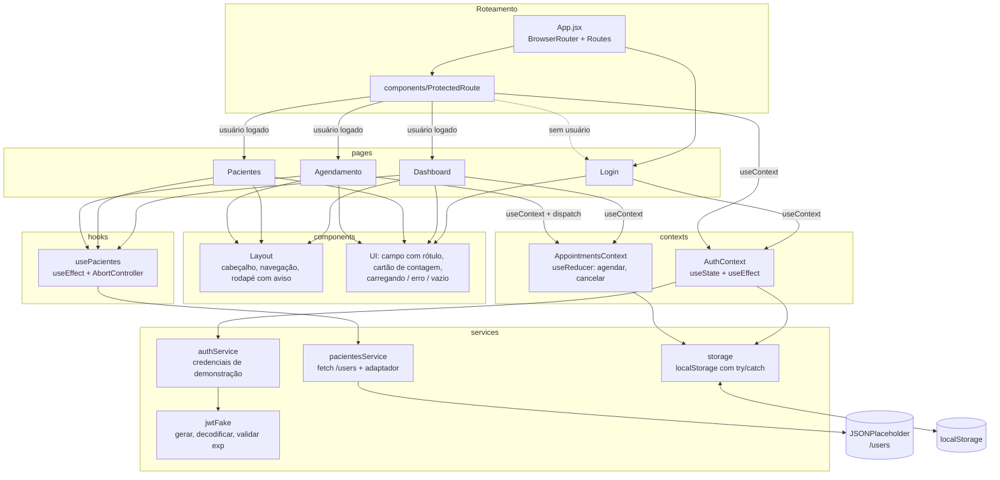
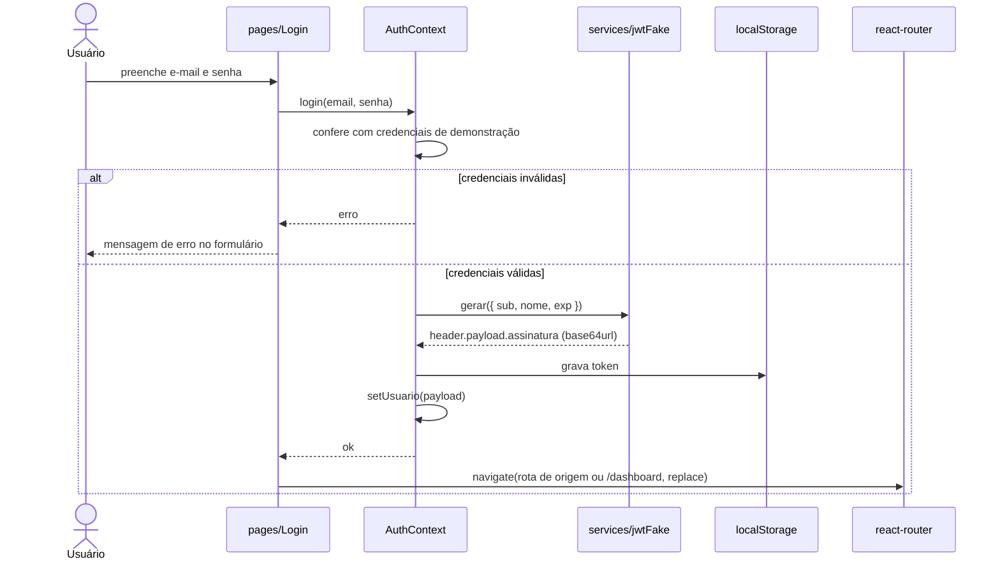
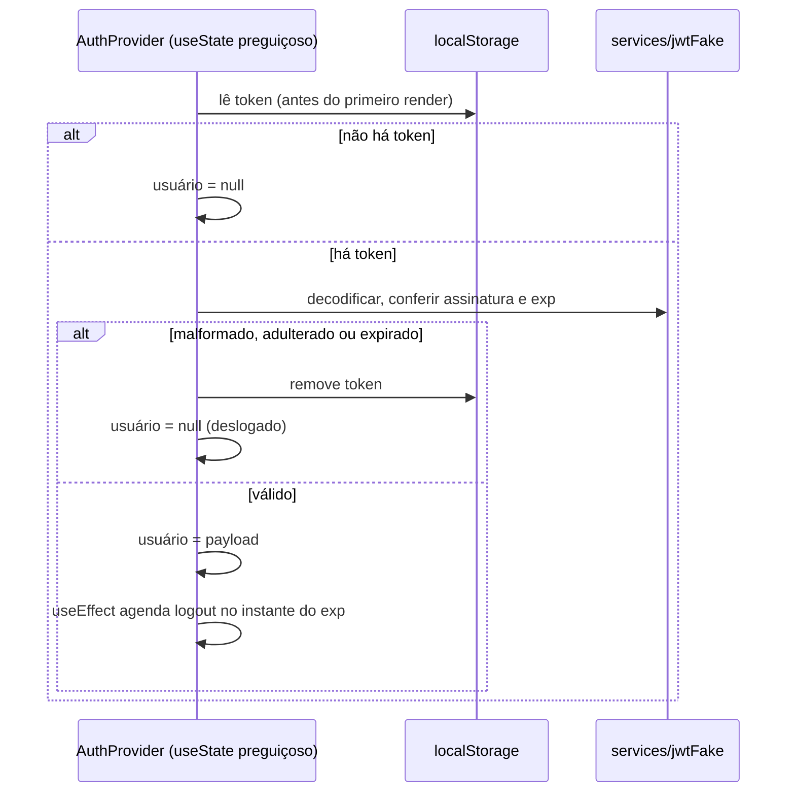
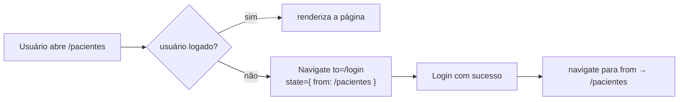

# Arquitetura — CardioIA Portal

> Escrito na Etapa 1 e atualizado na Etapa 2 para refletir o que foi implementado. Uso de hooks detalhado em [`hooks.md`](hooks.md).

## 1. Camadas e dependências

A regra de dependência é de cima para baixo: páginas usam componentes e contexts; contexts usam services; services não conhecem React.

| Camada | Pasta | Responsabilidade | Hooks típicos |
|---|---|---|---|
| Rotas | `src/App.jsx`, `components/ProtectedRoute` | mapear URL para página; barrar acesso sem login | `useContext`, `useLocation` |
| Páginas | `src/pages/` | compor a tela; tratar carregando/erro/vazio | `useState` + hooks próprios |
| Hooks próprios | `src/hooks/` | lógica de React reaproveitada entre páginas (busca de pacientes, título) | `useState`, `useEffect`, `useCallback` |
| Componentes | `src/components/` | UI reutilizável, sem conhecer API | props (`Layout` e `ProtectedRoute` leem `useAuth`) |
| Contexts | `src/contexts/` | estado global: sessão e consultas | `useState`, `useReducer`, `useEffect` |
| Services | `src/services/` | HTTP, adaptador, JWT fake — funções puras | nenhum |

### Por que consultas vivem num context e pacientes não

- **Consultas** são criadas no formulário (`Agendamento`) e contadas em outra tela (`Dashboard`). Estado que duas rotas precisam ler precisa estar acima das duas → `AppointmentsContext`.
- **Pacientes** vêm da API; cada página que precisa usa o hook `usePacientes`, que busca pelo service e **cancela a requisição quando a página sai** (`AbortController`). Não há escrita, então não há estado a compartilhar. Custo aceito: uma requisição por página visitada (a lista tem 10 itens).
- As **regras** de agendamento moram no reducer (`contexts/appointmentsReducer.js`), não no formulário. `agendar()` roda o próprio reducer (função pura) para saber se a ação é aceita, devolve os erros por campo ao formulário e só então despacha.

### Adaptador usuário → paciente

`pacientesService` busca `/users` e converte cada usuário num paciente `{ id, nome, codigo, idade, sexo }`:

- **Minimização (LGPD, art. 6º, III):** só `id` e `name` são aproveitados; `email`, `phone`, `address` e os demais campos são descartados.
- **Idade e sexo são simulados**, saídos de uma função **determinística do `id`** (mesmo `id`, mesmo paciente, sem `Math.random`) e sem relação com o nome. A tela os marca como "simulado".
- **Nenhum diagnóstico, nível de risco ou rótulo clínico** é gerado: o portal não diagnostica.

## 2. Fluxo de autenticação

### 2.1 Login

### 2.2 Carga da aplicação (token já gravado)

A validação acontece na **inicialização preguiçosa** do `useState` (`useState(carregarSessao)`), que roda de forma síncrona antes do primeiro render. Assim o `ProtectedRoute` nunca vê um `usuário = null` falso durante a carga, e não é preciso um estado de "carregando" para a sessão. (A Etapa 1 previa esse estado; a inicialização preguiçosa o tornou desnecessário.)

### 2.3 Rota protegida

### 2.4 Logout

`logout()` remove o token do `localStorage` e zera o usuário; o `ProtectedRoute` da tela atual redireciona para `/login` no render seguinte.

## 3. Limites de segurança (aviso)

- O "JWT" é **fake**: a assinatura não é criptográfica e é gerada no próprio navegador. Serve só para simular o formato (header.payload.assinatura) e o controle de expiração.
- Token em `localStorage` é legível por qualquer script da página, portanto **vulnerável a XSS**. Aplicações reais guardam o token em **cookie `httpOnly`** emitido pelo servidor e validam a assinatura no back-end.
- A proteção de rotas aqui é só de **interface**: não há dado sensível no servidor para proteger. Tudo é simulação acadêmica.
