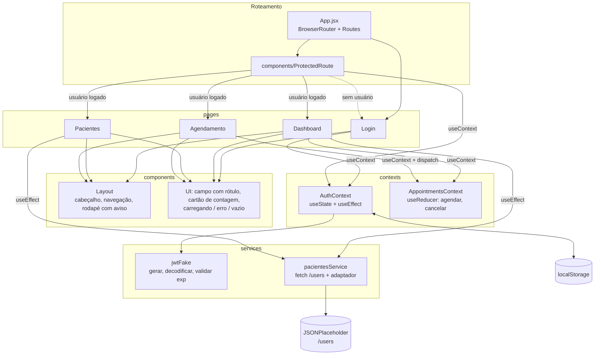
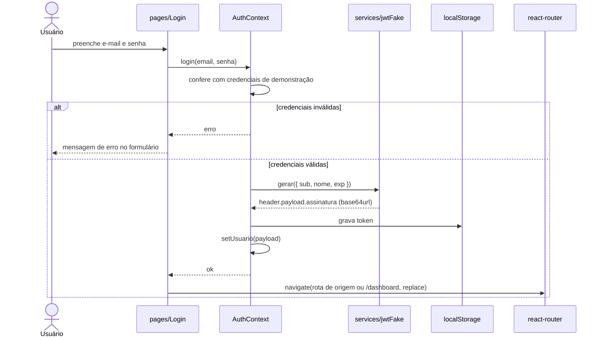
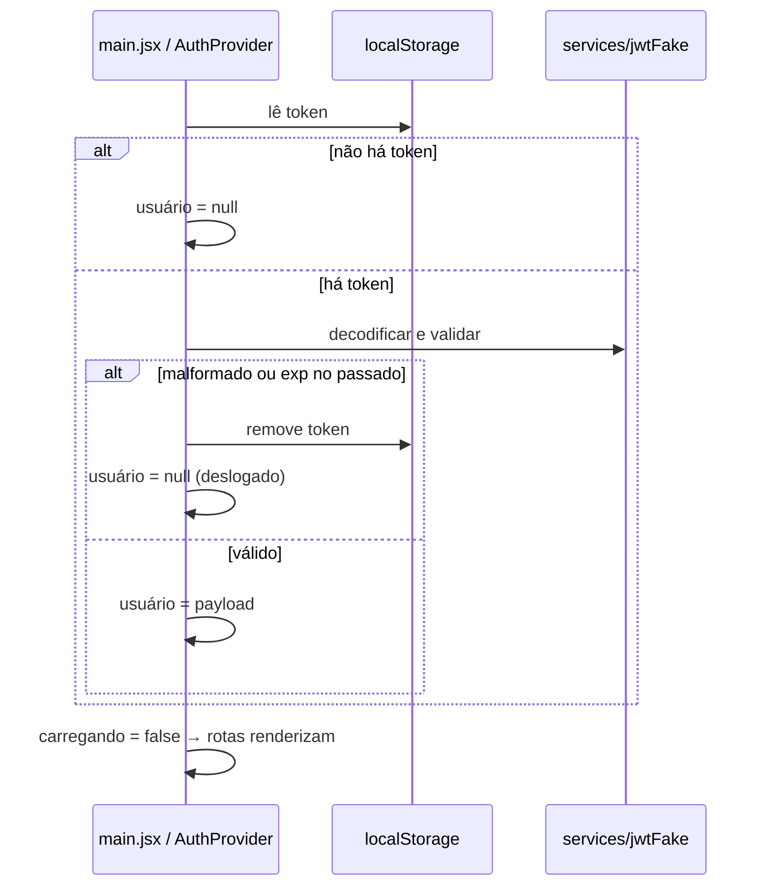
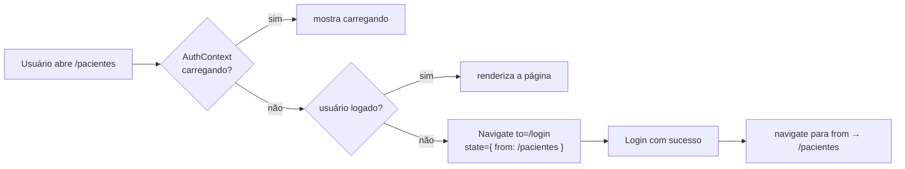

# Arquitetura — CardioIA Portal

> Documento da Etapa 1 (fundação). Descreve a arquitetura **planejada**; nada disto está implementado ainda.

## 1. Camadas e dependências

A regra de dependência é de cima para baixo: páginas usam componentes e contexts; contexts usam services; services não conhecem React.

| Camada | Pasta | Responsabilidade | Hooks típicos |
|---|---|---|---|
| Rotas | `src/App.jsx`, `components/ProtectedRoute` | mapear URL para página; barrar acesso sem login | `useContext`, `useLocation` |
| Páginas | `src/pages/` | compor a tela; buscar dado; tratar carregando/erro/vazio | `useState`, `useEffect`, `useContext` |
| Componentes | `src/components/` | UI reutilizável, sem conhecer rota nem API | props |
| Contexts | `src/contexts/` | estado global: sessão e consultas | `useState`, `useReducer`, `useEffect` |
| Services | `src/services/` | HTTP, adaptador, JWT fake — funções puras | nenhum |

### Por que consultas vivem num context e pacientes não

- **Consultas** são criadas no formulário (`Agendamento`) e contadas em outra tela (`Dashboard`). Estado que duas rotas precisam ler precisa estar acima das duas → `AppointmentsContext`.
- **Pacientes** vêm da API; cada página que precisa busca pelo service. Não há escrita, então não há estado a compartilhar. (Se a busca duplicada incomodar, o service pode guardar a resposta em memória — decisão da Etapa 2.)

### Adaptador usuário → paciente

`pacientesService` busca `/users` e converte cada usuário num paciente. Campos clínicos simulados (status, próxima consulta etc.) saem de uma função **determinística do `id`**: o mesmo `id` gera sempre o mesmo paciente, sem `Math.random`. Isso deixa a tela estável entre recargas e o vídeo reproduzível.

## 2. Fluxo de autenticação

### 2.1 Login

### 2.2 Carga da aplicação (token já gravado)

O `AuthContext` expõe um estado de **carregando** durante essa checagem. Sem ele, o `ProtectedRoute` veria `usuário = null` no primeiro render e mandaria para `/login` quem já estava logado.

### 2.3 Rota protegida

### 2.4 Logout

`logout()` remove o token do `localStorage` e zera o usuário; o `ProtectedRoute` da tela atual redireciona para `/login` no render seguinte.

## 3. Limites de segurança (aviso)

- O "JWT" é **fake**: a assinatura não é criptográfica e é gerada no próprio navegador. Serve só para simular o formato (header.payload.assinatura) e o controle de expiração.
- Token em `localStorage` é legível por qualquer script da página, portanto **vulnerável a XSS**. Aplicações reais guardam o token em **cookie `httpOnly`** emitido pelo servidor e validam a assinatura no back-end.
- A proteção de rotas aqui é só de **interface**: não há dado sensível no servidor para proteger. Tudo é simulação acadêmica.
